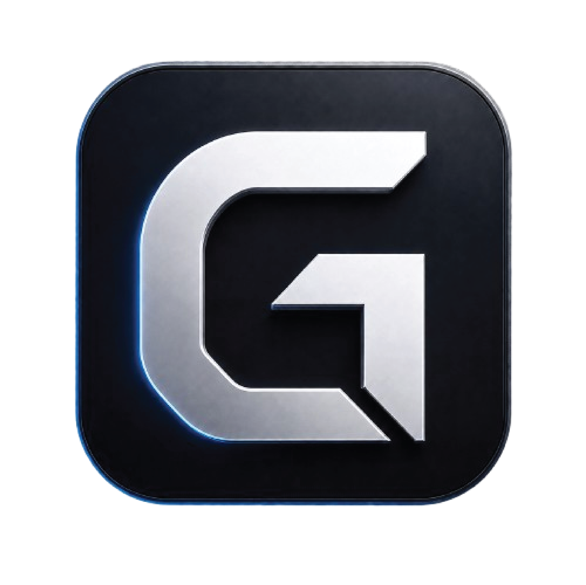

<p align="center">
  
</p>

<h1 align="center">GPi</h1>

<p align="center">
  A local glass cockpit GUI for Pi.
</p>

<p align="center">
  <a href="https://github.com/SynrgStudio/gpi/actions/workflows/ci.yml"></a>
  <a href="https://github.com/SynrgStudio/gpi/releases"></a>
  
  
  
</p>

<p align="center">
  <a href="https://synrgstudio.github.io/gpi/">Docs</a>
  ·
  <a href="https://github.com/SynrgStudio/gpi/releases">Releases</a>
  ·
  <a href="CHANGELOG.md">Changelog</a>
</p>

> Pi is the engine. GPi is the cockpit for managing multiple Pi projects and sessions.

GPi runs Pi sessions, keeps project context visible, and gives long-running agent work a persistent desktop shell.

## Workflow skills

GPi bundles optional continuity workflow skills under `resources/skills/continuity/`:

- `init-cont`
- `plan-cont`
- `start-cont`
- `end-cont`

These are product resources that power Continuity Mode: GPi's guided Install → Initialize → Plan → Start → End planning workflow. GPi installs the bundled skills into the user's Pi skills directory only after explicit user approval and preview.

The composer workflow button is one-shot, not a sticky mode:

- `Install` opens the workflow skill onboarding when skills are missing.
- `Initialize` sends `/init-cont` with optional composer context.
- `Plan` sends `/plan-cont` with optional composer refinement.
- `Start` sends `/start-cont` with optional scope.
- `End` sends `/end-cont`.

Pi executes the skills. GPi only guides the flow and sends visible commands.

Manual validation checklist: `docs/implementation/workflow-skills-validation.md`.

## Current status

Early scaffold. The project is intentionally mock-first before real Pi integration.

Chosen stack:

- Electron
- React
- TypeScript
- Node-side Pi SDK bridge migrating to WorkerPiRuntime

## MVP direction

GPi must support from the beginning:

- projects in a persistent sidebar
- multiple sessions/chats per project
- live status for non-selected sessions
- selected chat in the center
- tool/file/diff detail in a right panel
- a fast, keyboard-friendly input composer

## Non-goals for the MVP

- replacing Pi's agent engine
- duplicating provider/auth/tool/session systems
- cloud sync
- marketplace
- collaboration
- full IDE/editor scope
- cloud multi-agent orchestration; local multi-agent supervision is core

## Scripts

```bash
npm run check
npm run compile:electron
npm run dev:electron
npm run package:win
npm run installer:win
```

`npm run check` type-checks the scaffold. `npm run compile:electron` refreshes Electron main/preload output. `npm run dev:electron` compiles Electron code, starts Vite, and launches Electron against the local dev server.

`npm run package:win` builds and packages the Windows Electron app under `release/GPi-win32-x64`. `npm run installer:win` additionally runs Inno Setup and writes `release/installer/GPi-Setup-<version>.exe`.

The agent does not run `npm run dev`, `npm run dev:electron`, or `npm run build` unless explicitly requested.

## Releases

Push a semver tag to publish a Windows installer through GitHub Actions:

```bash
git tag v0.0.1
git push origin v0.0.1
```

The release workflow runs checks, unit tests, validates `CHANGELOG.md`, packages GPi, builds the Inno installer, and attaches it to a GitHub Release.

Before tagging, add release notes under `## [Unreleased]`, then run:

```bash
npm run release:prepare -- 0.0.X
```

This bumps package/installer versions and moves `[Unreleased]` notes into `## [0.0.X] - YYYY-MM-DD`. The release workflow fails if the tag version has no changelog section.

GPi Settings → Updates checks `https://github.com/SynrgStudio/gpi/releases` for newer app versions. When an installer asset is available, the `Update GPi` button downloads the installer in-app and changes to `Install Update`.

## Project structure

```text
src/
  bridge/      GPi↔Pi bridge interfaces and adapters
  domain/      project/session/status domain types
  main/        Electron main process
  preload/     Electron preload boundary
  renderer/    React UI shell
```

## Credits

- Git logo by [Jason Long](https://git-scm.com/downloads/logos), licensed under [Creative Commons Attribution 3.0 Unported](https://creativecommons.org/licenses/by/3.0/).

## Docs

- `docs/product/vision.md`
- `docs/product/mvp.md`
- `docs/product/ux-shell.md`
- `docs/product/visual-system.md`
- `docs/technical/pi-integration.md`
- `docs/technical/domain-model.md`
- `docs/technical/persistence.md`
- `docs/adr/0001-gpi-architecture.md`
- `docs/implementation/roadmap.md`
- `docs/implementation/manual-real-pi-validation.md`
- `docs/implementation/windows-packaging.md`
